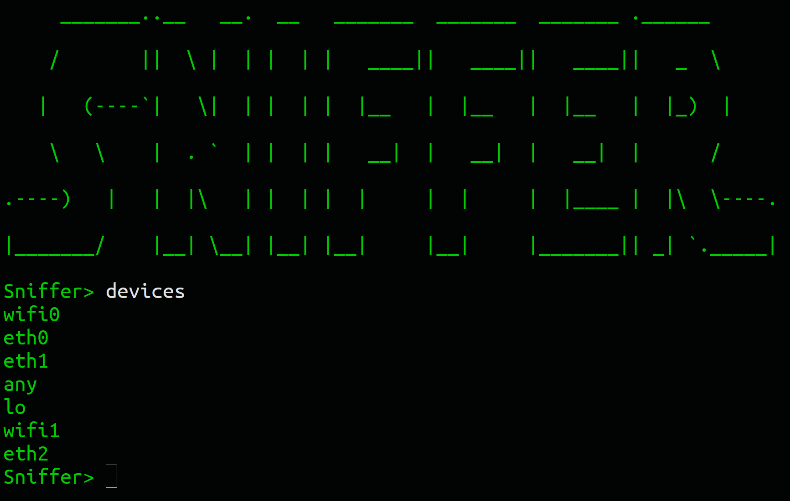

# Sniffer (pre-alpha)

Sniffer is a binary which can capture and analyze network packets on a given device. The aim of the application is to offer DNI selectors for cybersurveillance purposes, based on NSA's Unified Targeting Tool.

## Do not use in production.

More information soon.

### Installation

Makefile assumes Python version 2 and pip package manager are installed on the system.

```
make install
```

### Run the application

```
make run
```

### Cleanup compiled Python bytecode

```
make clean-pyc
```


